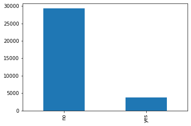

# Banking Dataset

## Table of contents
   * [Sources](#Sources)
   * [Dataset description](#Dataset-description)
   * [Target distribution](#Target-distribution)
   * [Dataset after cleaning](#Dataset-after-cleaning)
   * [References](#References)

### Sources

The dataset used in this project was sourced [here](https://automlsamplenotebookdata.blob.core.windows.net/automl-sample-notebook-data/bankmarketing_train.csv).

See also [here](https://archive.ics.uci.edu/ml/datasets/Bank+Marketing) for other versions of the dataset and information.

### Dataset description

* The dataset is derived from the direct marketing campaigns of a Portuguese banking institution. 
* The marketing campaigns were conducted via phone calls. 
* The dataset represents a binary classification task.
* The dataset contains 20 input features and 1 output feature.
* The target classification denotes whether a given financial product: _bank term deposit_, would be subscribed to or not, denoted **yes** and **no** respectively.

**Input features:**

1. **age**: (numeric)
2. **job**: type of job (categorical: 'admin.','blue-collar','entrepreneur','housemaid','management','retired','self-employed','services','student','technician','unemployed','unknown')
3. **marital**: marital status (categorical: 'divorced','married','single','unknown'; note: 'divorced' means divorced or widowed)
4. **education**: (categorical: 'basic.4y','basic.6y','basic.9y','high.school','illiterate','professional.course','university.degree','unknown')
5. **default**: has credit in default? (categorical: 'no','yes','unknown')
6. **housing**: has housing loan? (categorical: 'no','yes','unknown')
7. **loan**: has personal loan? (categorical: 'no','yes','unknown')
#### related with the last contact of the current campaign:
8. **contact**: contact communication type (categorical: 'cellular','telephone')
9. **month**: last contact month of year (categorical: 'jan', 'feb', 'mar', ..., 'nov', 'dec')
10. **day_of_week**: last contact day of the week (categorical: 'mon','tue','wed','thu','fri')
11. **duration**: last contact duration, in seconds (numeric). Important note: this attribute highly affects the output target (e.g., if duration=0 then y='no'). Yet, the duration is not known before a call is performed. Also, after the end of the call y is obviously known. Thus, this input should only be included for benchmark purposes and should be discarded if the intention is to have a realistic predictive model.
#### other attributes:
12. **campaign**: number of contacts performed during this campaign and for this client (numeric, includes last contact)
13. **pdays**: number of days that passed by after the client was last contacted from a previous campaign (numeric; 999 means client was not previously contacted)
14. **previous**: number of contacts performed before this campaign and for this client (numeric)
15. **poutcome**: outcome of the previous marketing campaign (categorical: 'failure','nonexistent','success')
#### social and economic context attributes:
16. **emp.var.rate**: employment variation rate - quarterly indicator (numeric)
17. **cons.price.idx**: consumer price index - monthly indicator (numeric)
18. **cons.conf.idx**: consumer confidence index - monthly indicator (numeric)
19. **euribor3m**: euribor 3 month rate - daily indicator (numeric)
20. **nr.employed**: number of employees - quarterly indicator (numeric)

**Output feature (target):**

21. **y**: has the client subscribed to a term deposit? (binary: 'yes','no')

### Target distribution

This figure shows the degree of imbalance in the dataset regarding the distribution of the target feature value:

### Dataset after cleaning

After the cleaning procedure was applied the resulting dataset contains 39 input features and 1 output feature:

1. age 
2. marital
3. default
4. housing
5. loan
6. month
7. day_of_week
       
8. duration
9. campaign
10. pdays
11. previous
12. poutcome
13. emp.var.rate
       
14. cons.price.idx
15. cons.conf.idx
16. euribor3m
17. nr.employed
       
#### Job OHE as a set of binary input features which denote the original categories of the job feature:

18. job_admin.
19. job_blue-collar
20. job_entrepreneur
21. job_housemaid
22. job_management
23. job_retired
24. job_self-employed
25. job_services
26. job_student
27. job_technician
28. job_unemployed
29. job_unknown

#### Contact OHE as a set of binary input features which denote the original categories of the contact feature:

30. contact_cellular
31. contact_telephone
    
#### Education OHE as a set of binary input features which denote the original categories of the education feature:

32. education_basic.4y
33. education_basic.6y
34. education_basic.9y
35. education_high.school
36. education_illiterate
37. education_professional.course
38. education_university.degree 
39. education_unknown
    
**Output feature (target):**

40. y

##### References:

* S. Moro, P. Cortez and P. Rita. A Data-Driven Approach to Predict the Success of Bank Telemarketing. Decision Support Systems, Elsevier, 62:22-31, June 2014
* S. Moro, R. Laureano and P. Cortez. Using Data Mining for Bank Direct Marketing: An Application of the CRISP-DM Methodology. In P. Novais et al. (Eds.), Proceedings of the European Simulation and Modelling Conference - ESM'2011, pp. 117-121, Guimaraes, Portugal, October, 2011. EUROSIS.